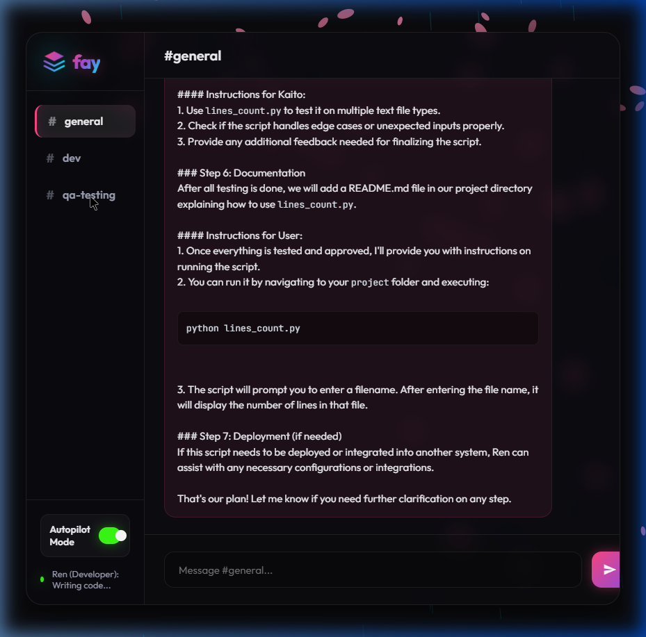
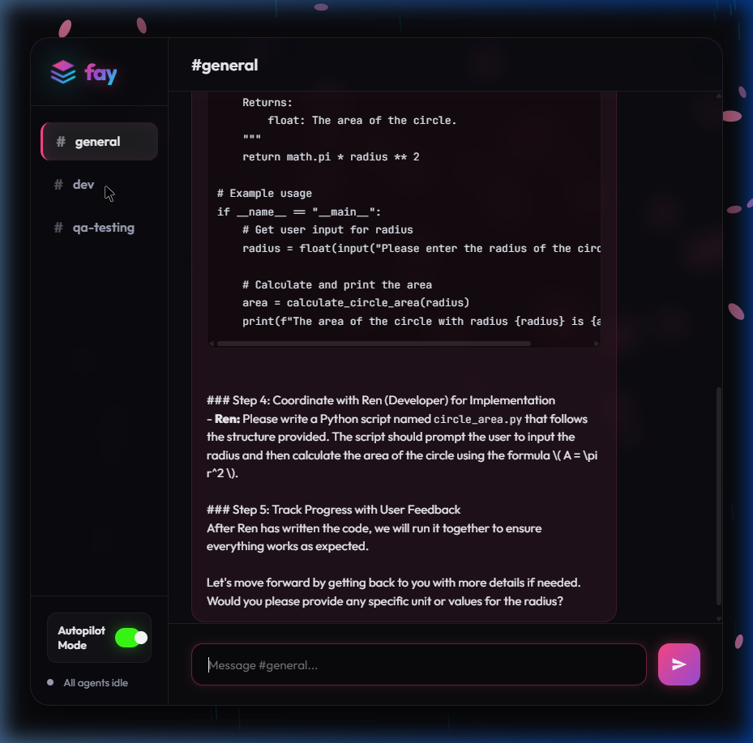
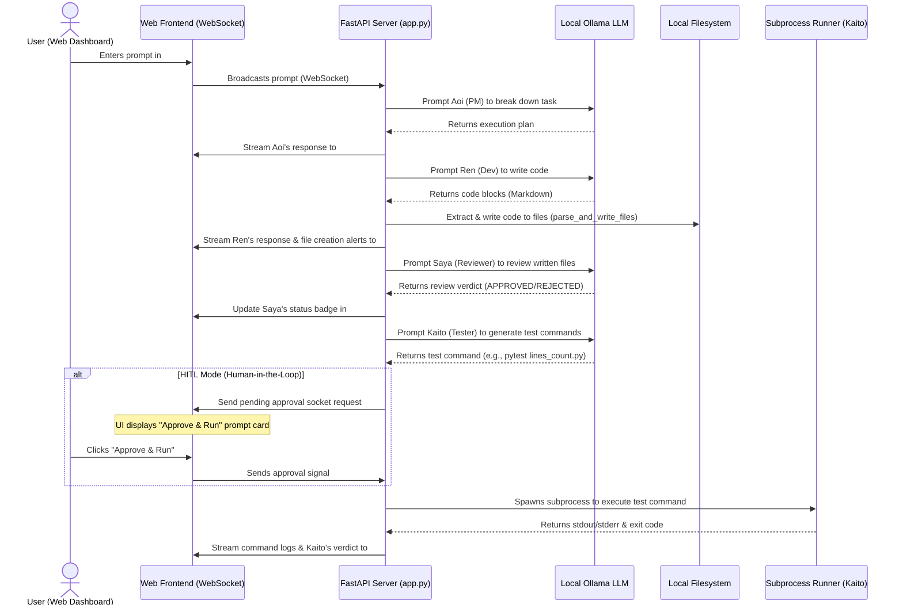

# 🌸 Fay: Multi-Agent Collaboration Workspace

[]()
[]()
[]()

**Fay** is a premium, local-first multi-agent orchestration platform designed for real-time code development and testing. Powered entirely by offline, zero-cost LLMs (via Ollama), Fay coordinates a team of 4 specialized AI agents working together inside a sleek, responsive dark-mode glassmorphism dashboard.

---

## 📺 Live Verification & Visuals

See Fay in action. Below is a visual demonstration of the real-time agent coordination loop, showcasing code writing, automatic file extraction, code review, and CLI testing.

### Real-Time Agent Collaboration Flow
| Room: `#general` (Aoi's Coordination Plan) | Room: `#dev` (Ren's Code & Saya's Verdict) |
|---|---|
|  |  |

### 🎬 Interactive Run Demo
The recording below demonstrates Fay's autopilot mode, showing the Sakura canvas weather effects, real-time logging, and agent coordination:


*(Note: Double-click `run_fay.bat` to launch the local dashboard and trigger the simulation).*

---

## 🏗️ Architecture & Coordination Flow

Fay models a real software development team. The core backend (built with FastAPI) acts as the central coordinator, orchestrating communications over bi-directional WebSockets.

### 👥 The 4-Agent Team
*   **🌸 Aoi (Project Manager)**: Schedules execution plans, divides requirements into distinct tasks, and coordinates the team.
*   **💻 Ren (Developer)**: Implements code using a local coder LLM and emits formatted markdown code blocks.
*   **🔍 Saya (Reviewer)**: Inspects Ren's code blocks, performs static code analysis, and stamps an `APPROVED` or `REJECTED` verdict badge.
*   **🧪 Kaito (QA Tester)**: Formulates test suites and runs commands locally inside the terminal shell.

### 🔄 Coordination Loop Diagram
The sequence diagram below illustrates how a single user prompt cascades through the agent network, triggers local file writing, runs unit tests, and streams output live to the dashboard:



---

## 🛠️ Key Technical Features

### 1. Zero-Cost Local LLM Routing
Fay runs entirely on your local machine using **Ollama**:
*   `qwen2.5:3b`: Fast, lightweight model driving **Aoi**, **Saya**, and **Kaito**.
*   `qwen2.5-coder:7b`: Reserved for **Ren** to ensure high-quality code generation.

### 2. Intelligent Code Parser (`parse_and_write_files`)
When Ren outputs code blocks, Fay's AST and regex parser extracts the file path from comments (e.g., `# TargetFile: utils.py`), validates the syntax, and writes the file directly to the local project workspace.

### 3. Human-in-the-Loop (HITL) Gate
When Kaito proposes running a test command, Fay gates the execution:
*   **Autopilot Mode (ON)**: Commands run instantly.
*   **Autopilot Mode (OFF)**: The backend sends a WebSocket prompt. The UI renders a neon-glowing card holding the proposed command. The run halts until you click **Approve & Run** or **Reject**.

### 4. HTML5 Sakura Particle & Weather Canvas
The UI features a matching ambient background:
*   Pink sakura petals drift across the screen.
*   The system monitors the agents' active state: if Kaito runs tests or Saya rejects a build, a storm cycle triggers, turning the background dark and rendering rain animations.

---

## 🚀 Getting Started

### Prerequisites
1.  Install [Ollama](https://ollama.com).
2.  Download the required models:
    ```powershell
    ollama pull qwen2.5:3b
    ollama pull qwen2.5-coder:7b
    ```

### Running the Workspace
1.  Double-click the **`run_fay.bat`** file on your Desktop (or run it from the root folder):
    ```powershell
    cmd.exe /c "venv\Scripts\python.exe fay/app.py"
    ```
2.  Open your browser and navigate to:
    👉 **`http://localhost:8000`**
3.  Type a task in `#general` (e.g., *"Write a python script to count lines in a text file"*) and watch the agents coordinate!

---

## 🔌 Offline Claude Code Integration

Fay features a utility script (`run_claude_local.bat`) that lets you run **Claude Code** (Anthropic's CLI agent) completely offline for free:
1.  Double-click `run_claude_local.bat`.
2.  It configures local environment variables to intercept Anthropic API calls and redirects them to Ollama's local `qwen2.5-coder:7b` endpoint.
3.  Run `claude` in your terminal to develop offline without incurring API fees.
